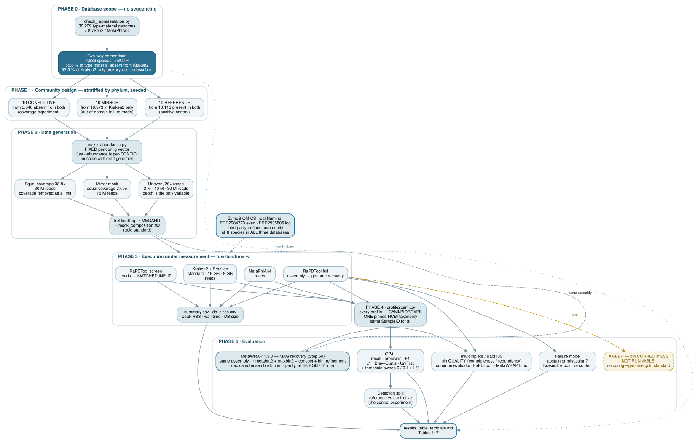

# Benchmark design — flow, rationale, and what each test actually measures

This document explains **why the benchmark is shaped the way it is**. `README.md` is
the operational how-to; this is the reasoning behind it. Read this before writing the
manuscript, and before changing any step.

---

## 1. The flow



> **Source of truth: `data/benchmark_flow.dot`.** Render with:
> ```bash
> dot -Tsvg data/benchmark_flow.dot -o figures/benchmark_flow.svg
> dot -Tpng -Gdpi=300 data/benchmark_flow.dot -o figures/benchmark_flow.png
> dot -Tpdf data/benchmark_flow.dot -o figures/benchmark_flow.pdf
> ```
> A hand-maintained mermaid copy used to live here; it was removed because two
> hand-written diagrams of the same process drift apart silently. Edit the `.dot`
> and re-render.

Read the diagram as three independent evidence streams that meet at the results table:

- **Phase 0 alone** produces a publishable claim that involves no simulated data and
  does not depend on RaPDTool behaving well.
- **Phases 2–5** produce the accuracy and resource claims.
- The dashed edge to AMBER is a **known gap**, not an oversight (see §4).

---

## 2. Why each phase exists

### Phase 0 — the census

**Question:** what does each database actually contain?

Every accuracy benchmark on a hand-picked community invites the same objection: *you
chose the organisms*. The census removes that argument from the accuracy discussion by
answering the coverage question separately, over the entire reference set, with no
sampling at all. It converts the later mock result from an anecdote about 20 genomes
into a sample from a population whose size is known.

It is also the only result here that is **independent of RaPDTool's behaviour**. If
every accuracy number came out badly, "Kraken2's 103.7 GB standard database omits
55.8 % of characterised type material" would still stand. Lead with it.

### Phase 1 — community design

**Question:** which organisms expose the difference between the tools?

Two halves, each doing a distinct job:

| Half | Drawn from | Purpose |
|---|---|---|
| 10 **reference** | 11,552 genomes present in both competitor DBs | Positive control: every tool has these species in its index, so all should succeed. Establishes the baseline against which the conflictive half is read. |
| 10 **conflictive** | 3,423 genomes absent from both | The coverage experiment. Read classifiers cannot resolve what is not in their index. |

Stratifying the conflictive half by phylum (one per phylum) prevents Actinomycetota
and Pseudomonadota — over half the absent population — from dominating the sample.

### Phase 2 — data generation

**Question:** how do we get reads whose truth we know, without handing RaPDTool its
own reference files?

Reads are simulated and then **re-assembled**, so RaPDTool's assembly-based mode
operates on reconstructed contigs rather than on the sequences its database was built
from. This does not remove the fact that these organisms are in its database — nothing
can — but it removes the trivial "it is reading its own input" objection.

Two composition regimes, because they answer different questions:

| Regime | What it isolates | What it cannot tell you |
|---|---|---|
| **Uneven, 3 depths** (3M/10M/30M, 20× dynamic range) | How each tool responds to sequencing depth under a realistic, uneven community | Nothing about intrinsic capability at adequate coverage — the rare members never assemble |
| **Equal coverage, 30M** | Intrinsic capability with coverage removed as a limiting factor (all 20 genomes at 38.8×) | Nothing about realistic performance — real communities are never even |

Neither is "the realistic one" and neither is redundant. Without the depth series you
cannot claim anything about real data; without the equal-coverage control you cannot
distinguish *"the tool is weak"* from *"the data was thin"*.

**A fixed abundance vector is used across the depth series**, so depth is the only
variable between those three datasets. InSilicoSeq redraws a random composition on
every invocation; three independent draws would confound depth with composition.

> **Critical InSilicoSeq artefact — document this in the manuscript.**
> `iss --abundance <dist>` assigns abundance **per FASTA record (contig)**, not per
> genome. With draft multi-contig genomes the realised per-genome abundance therefore
> tracks **contig count**, largely regardless of the distribution requested. Measured
> on this genome set with `--abundance uniform`: a 1,491-contig genome received 61.3 %
> of the reads while a single-contig genome received 0.04 % — a 1,000-fold coverage
> range from a request for uniformity. `make_abundance.py` exists to fix this: it
> assigns per-genome fractions explicitly and splits each across that genome's contigs
> **proportionally to contig length**, so coverage is even along each genome.
> Any benchmark that used `iss --abundance` with draft genomes and did not check the
> realised composition has this artefact.

### Phase 3 — execution under measurement

**Question:** what does each tool cost?

`/usr/bin/time -v` wraps each invocation and records *Maximum resident set size* and
*Elapsed (wall clock) time*. Two measurement subtleties matter:

- **Every tool is launched by absolute path**, not resolved through `PATH`. This is a
  correctness requirement, not a preference: a full overnight run once completed in
  minutes with no data because `kraken2` and `metaphlan` exited 126 in 0.0 s per tool —
  the conda env was not active, and this host's `PATH` begins with relative entries
  (`.`, `./bin`, `./scripts`), so resolution depends on the working directory. The
  script now runs a **preflight check** that aborts in seconds if any enabled tool or
  input is missing, rather than producing an empty matrix hours later.
- **RaPDTool specifically is launched by absolute path to its wrapper**, not through
  `conda run`. The wrapper `exec`s Apptainer, so `/usr/bin/time` measures the real
  process chain; `conda run` inserts a persistent Python parent that under-reports
  peak RSS.
- **A failed run is discarded whole, not repaired.** Deleting the affected output
  directory and re-running costs less than the ambiguity of a hand-edited
  `summary.csv` sitting beside `.stderr` files from a different attempt. Provenance —
  one directory, one command, one configuration — matters more here than the ~20
  minutes of recomputation, because these directories become supplementary material.
- **Resources are replicated (n=3), accuracy is not.** All compared tools are
  deterministic for a given input, so replicating accuracy measures nothing.
  Replication exists to bound timing/memory variance, which was small (peak RSS
  identical to two decimals; wall-clock within ±5 %).

RaPDTool is run in **two modes**, and conflating them is the easiest way to draw an
invalid comparison from this benchmark:

| Mode | Input | Used for | Never used for |
|---|---|---|---|
| `screen` | reads | Accuracy head-to-head vs Kraken2/MetaPhlAn — **matched input** | Genome recovery (it produces no bins) |
| `full` | assembly | Genome recovery, MAG quality, type-material placement | Claiming an accuracy win over read classifiers without disclosing that assembly is a prerequisite step |

### Phase 4 — harmonisation

**Question:** are we comparing taxa, or comparing spelling?

Each tool reports its own taxonomy with its own names and its own rank strings. FOCUS
uses updated phylum names (*Pseudomonadota*), Kraken2 carries its database's taxdump,
MetaPhlAn carries SGB lineages. `profile2cami.py` resolves every leaf to an **NCBI
taxid** and re-derives the full standard-rank lineage from **one pinned taxonomy dump**
(the same one the reference database was built from, SHA-256 recorded). Without this,
apparent differences between tools are partly nomenclature.

Two operational rules, both learned the hard way:

- **Every profile, including the gold standard, must carry the same `SampleID`**
  (`-s mock`). OPAL silently skips any profile whose sample ID does not match the gold
  standard, and then reports that nothing could be evaluated.
- Check the `abundance mapped=…%` line for each conversion. Below ~90 %, investigate
  before trusting any downstream metric.

### Phase 5 — evaluation

See §3 for what each metric means.

#### RaPDTool has two species outputs — detection from mash, abundance from FOCUS

This is the single most consequential measurement decision in the benchmark, and it was
initially got wrong. RaPDTool emits two species-level outputs from different engines:

- **`rapdtool_confidence.tbl` — the mash-screen containment table.** RaPDTool's confident
  species DETECTION: reference genomes contained in the sample above a threshold, with
  identity and shared-hashes. On the mock this is exactly the true species with **zero
  false positives**; on real Zymo data, exactly the 8 members with 0 false positives.
- **FOCUS `output_All_levels.csv` — the k-mer ABUNDANCE profile.** ~204 species on
  `mock_ln_30M`, carrying a long low-abundance tail, which RaPDTool's own output labels
  "*be cautious at species taxonomic level*".

**Detection metrics (recall, precision, F1, the reference/conflictive split) must come
from the mash table; abundance metrics (Bray-Curtis, L1) from FOCUS.** Using FOCUS for
detection understates RaPDTool severely — it would score its detection precision at ~0.10
(the 184-species tail) when its actual detection output has precision 1.0. The mash table
is not "a 1 %-filtered FOCUS"; it is a different engine (containment vs composition), and
it is RaPDTool's answer to "which species are here".

This also dissolves an apparent problem. Measured this way, RaPDTool's detection F1 is 1.0
with **no threshold**, beating MetaPhlAn's 0.556 outright — the comparison is each tool's
confident detection output against the gold (RaPDTool mash ↔ MetaPhlAn's marker-filtered
list ↔ Kraken/Bracken's report), which is the fair like-for-like.

#### The FOCUS threshold sweep is an abundance caveat, not the detection story

Because the FOCUS *abundance* profile does carry a false-positive tail, interpreting it
requires a cutoff. A threshold applied uniformly to every tool's output profile
(post-hoc, downstream of each tool's own detection gate) raises FOCUS-based F1 past
MetaPhlAn at ≥0.1 % and to 1.0 at 0.5 % (`figures/f1_threshold.*`, `threshold_sweep.*`).
Report this as **context for reading FOCUS abundance**, not as RaPDTool's detection
result — the mash table already gives F1 1.0 with no threshold. Two honest notes if the
sweep is shown: the cutoff is not MetaPhlAn's internal marker gate (which cannot be
applied to other tools), so it is disclosed as a post-hoc output filter; and a 1 % cutoff
drops the two genomes below 1 % abundance by design (smallest true abundance 0.76 %),
which is why 0.5 % — keeping all twenty with no false positives — is the FOCUS operating
point, not 1 %.

But the unfiltered profile is not the whole story either, because 1 % *is* RaPDTool's
default operating point — what a user actually sees. The resolution is a **threshold
sweep applied identically to every tool**: no filter (the OPAL primary), and 0.1 / 0.5 /
1 %. The measured optimum is **0.5 %**, where RaPDTool screen reaches recall 1.0,
precision 1.0, F1 1.0 (`figures/f1_threshold.*`); 1 % is worth reporting only because it
is the current default.

> **Design interaction to state explicitly.** Two of the twenty genomes sit below 1 %
> abundance by construction (0.89 % and 0.76 %), so a 1 % threshold necessarily drops
> them — a design artefact, not a miss. In practice a 1 % cutoff on RaPDTool screen
> recovers 16/20, not the design ceiling of 18/20, because FOCUS's estimated abundance
> for another pair of genomes near the boundary also falls just under 1 %. A **0.5 %**
> cutoff keeps all twenty (their smallest true abundance, 0.76 %, is above it) while
> still removing every false positive — which is exactly why 0.5 %, not 1 %, is the
> recommended operating point.

---

## 3. What each test measures — and how to read it

### OPAL — composition accuracy

Compares a predicted profile against the gold standard at every rank.

| Metric | Question it answers | Reading it |
|---|---|---|
| **Recall** | Of the taxa truly present, how many were found? | Penalises missing taxa. A conservative tool scores low. |
| **Precision** | Of the taxa reported, how many were really there? | Penalises false positives. A permissive tool scores low. |
| **F1** | Harmonic mean of the two | One number, but it hides *which* error dominates — always report the components. |
| **L1 norm** | Total absolute abundance error, summed across taxa (0 = perfect, 2 = maximally wrong) | Presence/absence-insensitive tools can still score badly if they get proportions wrong. |
| **Bray–Curtis** | Ecological dissimilarity from the true community (0 = identical, 1 = no overlap) | The metric an ecologist will look for. Dominated by abundant taxa. |
| **Weighted UniFrac** | Abundance-weighted error that accounts for how *related* the mistakes are | Confusing a species with its sister costs less than confusing it with another phylum. Fairest metric when tools disagree at fine ranks. |

OPAL is used here for **abundance** (L1, Bray–Curtis) on the FOCUS and competitor
profiles. Its recall/precision/F1 columns are meaningful for the competitors but must
**not** be used for RaPDTool's detection, because they are computed on the FOCUS
abundance profile with its false-positive tail (which drops RaPDTool's OPAL precision to
~0.10). RaPDTool's detection is scored from the mash table instead — see below.

### Species detection — from the mash confidence table

RaPDTool's confident species DETECTION is the mash-screen table, not FOCUS (see Phase 5,
"two species outputs"). Against the gold standard it gives, on the mock, recall 1.0,
precision 1.0, F1 1.0, **zero false positives** — and it is the fair like-for-like with
MetaPhlAn's marker-filtered output and Kraken/Bracken's report (each tool's confident
detection). Computed by `mash_detection.py`.

### Detection split — reference vs conflictive (the central experiment)

The mash detection, split into the two halves of the community. This asks whether a tool
can report a taxon absent from its database (it cannot), and is interpretable because the
reference half controls for everything else. RaPDTool detects 10/10 reference **and**
10/10 conflictive; the competitors detect 10/10 reference and 0/10 conflictive.

Report both halves. The reference half is a control that RaPDTool passes: **10/10
reference species at 3, 10 and 30 M reads**. The conflictive result therefore rests on
the census (Table 1) and on the symmetric mirror experiment, not on any reference-half
difference.

### miComplete — bin quality

For each recovered genome bin, estimates **completeness** (what fraction of expected
single-copy marker genes are present) and **redundancy/contamination** (how many appear
more than once, indicating a bin that merged multiple organisms).

What it does **not** do: check whether the bin was assigned to the right organism. A
bin can be 98 % complete, 1 % redundant, and taxonomically mislabelled. miComplete
measures *bin quality*, never *bin correctness*.

The same miComplete/Bact105 run also re-scores MetaWRAP's bins, so the two pipelines'
MAG recovery is compared on a single evaluator (§4d).

### AMBER — bin correctness · **currently a gap**

AMBER evaluates binning against a **contig → source-genome truth table**: purity
(is each bin one organism?), completeness (did the bin capture all of that organism's
contigs?), and adjusted Rand index over the whole binning.

`make_mock.sh` produces only a *composition* gold standard, so **AMBER cannot be run on
this benchmark today**, and no claim of binning accuracy may be made. Two ways to close
it, in increasing order of cost:

1. **Extend `make_mock.sh`** to record each simulated read's source genome (InSilicoSeq
   encodes it in the read header) and derive the contig→genome truth by majority vote
   over the reads mapping to each assembled contig. Roughly a day of work; keeps
   everything in-house; produces exactly the file AMBER wants.
2. **Use a dataset that ships one** — CAMI II includes a binning gold standard (§4).

Until then Phase 5 reports bin quality only, and the manuscript must say so.

### Resource measurement

Peak RSS and wall-clock are straightforward; the number that carries the argument is
**database size on disk**, because it determines whether the tool can be deployed at
all. Report it separately from peak RAM — they are different constraints (a 103.7 GB
database can be stored on any laptop and loaded by almost none).

---

## 4. Scope of the design

### What this benchmark establishes

- **The census** is complete rather than sampled, covers the whole type-material set,
  and is independent of RaPDTool: a reviewer can recompute it from the competitor
  databases alone (`scripts/verify_kit.sh`, section 6).
- **Selection is deterministic and published.** Seeded scripts, the genome lists
  themselves, and a stated source population, so the mock composition is auditable
  rather than asserted.
- **Both halves are reported**, including the reference control — the condition in which
  RaPDTool holds no database advantage.
- **Taxonomy is harmonised.** One pinned NCBI dump with a recorded checksum, every tool
  mapped onto the same tree, comparisons made on taxids rather than on names.
- **Resources are measured over the full process tree**, n = 3, with the launcher
  behaviour documented (§3, Resource measurement).
- **Two composition regimes** — realistic (uneven) and idealised (equal coverage) — each
  with a stated purpose.
- **Out-of-domain behaviour is measured** (§4b): species calls only above the 95 % mash
  identity threshold, genus assignment at moderate distance, abstention below ~80 %.

### What it deliberately does not cover

- **Bin taxonomic correctness.** The mock communities provide no contig→genome truth
  table, so AMBER is not runnable (§3); no claim of binning accuracy is made. See the
  manuscript, Limitations.
- **Strain-level variation, and plasmid or eukaryotic fractions.** The communities are
  bacterial, one strain per species.
- **Real metagenomes with unknown truth.** These demonstrate practicality rather than
  accuracy, and accuracy is what this design measures.

### Addressed during this work

Out-of-domain failure mode (mirror experiment, §4b); an independent real dataset
(ZymoBIOMICS, §5b); and a dedicated MAG-recovery comparator — MetaWRAP run on the
identical assembly (§4d), where RaPDTool is at parity on binning while recovering the
same genomes at ~5× less RAM, naming them to type strains, and using 0.5 GB of reference
data against MetaWRAP's 72.7–378.7 GB.

---

## 4b. The mirror experiment — rank resolution vs genomic distance

The conflictive mock asks what happens to taxa **only RaPDTool's database contains**.
The mirror asks the opposite, and it is a *safety* question rather than a marketing one:

> When RaPDTool is given an organism absent from its database, does it abstain, or does
> it confidently assign it to the nearest type strain?

**Why declaring the limitation is not enough.** Stating "not intended for uncultured
organisms" is a scope statement, not evidence. Users feed environmental data to a tool
regardless of what the paper says, so the *failure mode* has to be measured, not assumed.

**The right question is not binary.** RaPDTool's mash step calls a species above ~95 %
identity to a database genome and a genus around 93–95 %; below that it should back off
to a coarser rank rather than assert a confident wrong species. So the meaningful test
is not "abstain vs misassign" but whether **the rank RaPDTool resolves an organism to
tracks its genomic distance from the database** — species only when genuinely close,
genus at moderate distance, nothing when far. Graceful degradation along that gradient
is the desirable, safe behaviour; a species call for a distant genome is the failure.

**Design.** Fourteen genomes spanning the full range of genomic distance to RaPDTool's
mash database, selected with `make_mirror_distance.py`: candidates were drawn from three
novelty tiers (genus present in RaPDTool / genus absent, family present / family absent),
downloaded, and the **minimum Mash distance to RaPDTool's database was measured** for
each — that measured distance, not the taxonomy tier, is the experiment's x-axis. The
set includes two species RaPDTool actually contains (Mash identity 100 %) as positive
controls, so the low-distance end is anchored too. Reads were simulated at equal coverage
(27.7×) so non-detection cannot be blamed on depth, and Kraken2 was run as a positive
control (all fourteen are in its database by construction).

**Result: RaPDTool degrades gracefully, with no exceptions across the fourteen**
(`figures/mirror_distance.{svg,png,pdf}`):

| Mash identity to nearest DB genome | rank RaPDTool resolves | n |
|---|---|---:|
| 100 % (in the database) | species | 2 |
| 97–99 % (novel species, very close) | species, to the nearest congener | 3 |
| 92–95 % | **genus only** — the mash step stops calling species | 3 |
| 82–91 % | genus, via the FOCUS profile | 3 |
| 70–76 % (family absent) | **abstains — not reported at all** | 3 |

The species/genus boundary landed exactly at RaPDTool's 95 % mash threshold, and no
genome below ~80 % identity received any assignment. **Not one distant genome was given
a confident species call.** This is a positive result: it answers the safety question
with "degrades gracefully", and the genus-zone organisms (whose genus *is* in the
database) double as evidence that when species-level resolution is not warranted,
RaPDTool still recovers the genus correctly rather than guessing.

**How to state it honestly.** Mash distance saturates around 0.25–0.30 (~70–75 %
identity) for anything beyond family level, so the three abstained genomes cluster there
and their exact distances are not meaningful — write "below ~80 % identity RaPDTool
abstains", not a falsely precise cutoff. And this is *out-of-domain behaviour*, not a
profiling-accuracy claim: it shows the tool fails safe, which is a different (and
arguably more important) property than how well it profiles in domain.

> **Earlier framing, now superseded.** An initial mirror run used ten random
> phylum-stratified genomes and was contaminated: four were species RaPDTool actually
> held under a strain taxid (a species-vs-strain comparison bug, since fixed — see the
> census note). That run is discarded. It did surface the bug, which is why the control
> earned its keep.

## 4c. What the two-way database comparison showed

Running the census in both directions produced the study's most defensible framing:

| | species |
|---|---:|
| RaPDTool type-material set | 21,639 |
| Kraken2 standard | 31,497 |
| **Present in both** | **7,836** |
| Kraken2 only | 23,661 — of which 14,013 viral, 9,640 prokaryotic |
| ↳ prokaryotic, **not formally described** | 9,205 (95.5 %) |
| Type-material genomes absent from Kraken2 | 16,854 of 30,209 (55.8 %) |

The databases are **largely disjoint and complementary**, differing along the
described/undescribed axis rather than in quality. Kraken2 indexes environmental and
undescribed diversity the type-material set excludes by construction; the type-material
set covers characterised type strains Kraken2 mostly lacks.

This is a stronger position than any superiority claim, because it is verifiable,
symmetric, and makes the niche argument follow from scope rather than from performance.

## 4d. MAG recovery vs a dedicated pipeline (MetaWRAP)

RaPDTool recovers genomes (`full` mode). The fair question is whether a **dedicated
MAG-recovery pipeline** does better on the same data. This is measured against **MetaWRAP
1.3.0** (the `metawrap-mg` biocontainer); reproduce with `scripts/run_metawrap.sh`, results
under `results/metawrap/`.

**Fair design — only the binning stage differs.** MetaWRAP is given the *same MegaHit
assembly RaPDTool consumed* (`asm/final.contigs.fasta` + the same reads); RaPDTool's `full`
mode likewise starts from that assembly, so both begin from an identical input. MetaWRAP ran
metabat2 + maxbin2 + concoct → `bin_refinement`. Because that refinement **optimises for
CheckM** and RaPDTool scores its bins with miComplete, **both bin sets are re-scored with the
same evaluator** (miComplete v1.1.1, Bact105) — otherwise the comparison would reward MetaWRAP
for its own objective.

The result is **parity on recovery, MetaWRAP marginally cleaner, at a large resource cost**:

| miComplete/Bact105 | 30 M mock — RaPDTool | MetaWRAP | Zymo even — RaPDTool | MetaWRAP |
|---|---:|---:|---:|---:|
| MAGs recovered | 19 | 19 | 7 | 8 |
| Median completeness | 96.2 % | 98.1 % | 98.1 % | 98.6 % |
| Median contamination | 2.4 % | 1.9 % | 2.8 % | 2.4 % |
| Per-bin species name | type strain + Mash distance | none | type strain | none |

Four honest statements:

1. **Recovery is at parity.** Both recover the same genomes; MetaWRAP's <10 % contamination
   filter removes the two chimeras RaPDTool reports — expected, because binning is MetaWRAP's
   *sole* purpose. **The Zymo 7-vs-8 gap is a binning-resolution difference, not a detection
   gap**: RaPDTool's mash-screen detects all 8 bacteria, resolving *E. coli* (98.7 % Mash
   identity) separately from *Salmonella* (100 %); the two only fail to separate at the
   *binning* step, where RaPDTool's single binner (MetaBAT2 → Binning_refiner) merges both
   Enterobacteriaceae into one chimeric bin — expected when two close relatives sit at equal
   abundance and coverage gives no separating signal. MetaWRAP's three-binner ensemble split
   them (one at 70 % completeness). The gap credits MetaWRAP's ensemble binning, not detection.
2. **The margin is expensive.** MetaWRAP's binning + refinement peaked at **34.9 GB RAM and
   ~61 min** (Zymo 34.1 GB / 42 min), driven by CheckM's pplacer placement. RaPDTool's *entire*
   `full` run — binning, per-bin type-anchored classification and MAG export from the same
   assembly — peaks at **6.73 GB and 2.6 min**: ~5× less RAM, ~23× less wall-clock.
3. **MetaWRAP's bins are anonymous.** binning + bin_refinement assign no species; the only
   taxonomy is CheckM's marker-set "lineage", coarse and often just "Bacteria". RaPDTool names
   each bin to a type strain with a Mash distance. Matching that needs `classify_bins` (NCBI_nt)
   or GTDB-Tk.
4. **Its read profiling is Kraken2.** MetaWRAP's read-level taxonomy module *is* Kraken/Kraken2,
   so it inherits the coverage gap of §4c (55.8 % of type material absent from Kraken2 standard)
   by identity — not re-run here.

**Deployment footprint — three levels.** MetaWRAP is modular, so count only the databases each
capability needs (sizes verbatim from the MetaWRAP README): binning/refinement needs **only
CheckM's 1.4 GB** — we did not download more, and do not imply binning requires it. But naming
the bins (reaching what RaPDTool outputs natively) needs `classify_bins` → **+71 GB** of
NCBI_nt, and the documented end-to-end workflow totals **378.7 GB**. RaPDTool's footprint is
**0.504 GB and constant** across all three levels, because one database delivers binning *and*
type-anchored taxonomy.

**Why MetaWRAP and not SqueezeMeta.** SqueezeMeta was the other assembly + binning + profiling
candidate. Reported from its documentation, not benchmarked: its databases occupy **470 GB**
(its manual recommends 700 GB free during the build), GTDB additional, and its DIAMOND-vs-nr
step scales RAM with database size. It has no maintained biocontainer, and a from-source build
did not resolve across several dependency stacks — a *documented deployment burden*, stated as
such, not a failure to install.

## 5. On adding CAMI II

**What it would add:** a binning gold standard, which would make AMBER runnable, and a
community of greater complexity than the mocks used here.

**What it would cost:** download and storage (tractable — a few TB of scratch space) and
considerable Kraken2-standard runtime on larger inputs. Scoping to **one or two samples**
rather than the full challenge would keep this manageable.

**The operating envelope it would probe.** RaPDTool's reference is type material —
30,209 characterised type strains — whereas CAMI II is rich in environmental and
uncultured organisms that have no type strain at all. The two address different
questions, and the study states that boundary explicitly rather than leaving it implied:

> RaPDTool's database covers characterised type material that the standard databases
> omit (55.8 % of it), and does not cover uncultured environmental diversity that they
> do. It is the right tool when the question is *which described species is this*, and
> the wrong one when the question is *what is in this unexplored environment*.

Stating that envelope is a more useful contribution than an unqualified claim of
superiority, and it points the tool at the users it actually serves.

**Decision status: not planned.** Superseded by two cheaper, more targeted additions
that between them close the same weaknesses:

- **The mirror experiment (§4b)** answers the out-of-domain question *directly* — and
  better than CAMI II would, because it isolates database absence as the single
  variable, with Kraken2 as a positive control. CAMI II would have answered it only
  indirectly and confounded with community complexity.
- **ZymoBIOMICS (§5b)** supplies real sequencing data for a community defined by a
  third party, which is the independence CAMI II was wanted for.

What remains **unaddressed** by this substitution, and should be stated as a limitation
rather than glossed over:

1. **Community complexity.** Zymo has 8 bacterial species and the mocks have 20. CAMI II
   has hundreds, with strain-level variation. No result here speaks to performance on
   communities of realistic complexity.
2. **Binning accuracy** still has no gold standard (§3, AMBER). CAMI II ships one;
   extending `make_mock.sh` to emit contig→genome truth is the in-house alternative and
   remains the cheapest way to close this.

Revisit if a reviewer asks for community-complexity evidence — that is the one thing
neither substitute provides.

## 5b. On ZymoBIOMICS as the real-data control

**What it is for:** every other dataset here is simulated from genomes we selected. Zymo
is real Illumina sequencing of a community whose composition a third party defined and
certified. It answers "does this work on data the authors did not construct?", which
nothing else in the study does.

**Why it is not benchmark shopping:** all eight bacterial species are present in all
three databases compared — verified against `data/census_full.tsv`. No tool has a coverage
advantage, in either direction, so the result cannot be an artefact of genome selection.
Choosing a dataset because it matches the tool's domain is correct design; choosing one
because you win on it is not. The distinction is whether the domain boundary is stated,
and here it is: see the corollary below.

**What it cannot show:** the eight species are common, well-characterised clinical
organisms — precisely the regime where RaPDTool is *not* differentiated. Zymo
demonstrates competence and parity on real data. It contributes nothing to the
coverage argument, which rests on the census and the conflictive mock. Do not let the
two be conflated in the Results.

**Two disclosures it forces** (both from the ZymoBIOMICS D6300/D6310 manual, ver. 1.3.0):

1. The two yeasts (4 % of DNA) are outside every bacterial/archaeal database compared;
   the gold standard is renormalised to the eight bacteria and this must be stated.
2. **Sequence abundance ≠ cell abundance.** Bracken reports the former (12 % per species
   here), MetaPhlAn the latter (6.1–21.6 %, genome-size normalised). Scoring both
   against one basis penalises one by up to two-fold. Zymo publishes both columns
   precisely because the distinction matters; evaluate each tool against the
   appropriate basis and say so.

---

## 6. Why RaPDTool has a niche despite Kraken2 being excellent

Kraken2 is faster per read, more sensitive on well-represented taxa, and better
engineered for scale. None of that is in dispute, and the manuscript should say so
plainly. The niche argument does not require Kraken2 to be worse; it requires the two
tools to answer different questions.

1. **The coverage gap is not a capacity problem, so it cannot be bought away.**
   Kraken2's standard database omits 55.8 % of characterised type material at 103.7 GB.
   Capping to 8.1 GB changes that by <0.01 pp. More RAM does not fix it; only a
   differently *composed* database does.

2. **The pincer.** To match RaPDTool's 6.73 GB memory footprint you must run a capped
   Kraken2 database — which loses sensitivity *and* still carries the full coverage gap.
   To get Kraken2's best sensitivity you need ~104 GB of RAM. RaPDTool occupies the
   corner neither configuration reaches: laptop-class memory with type-material coverage.

3. **Different output object.** Kraken2 labels reads. RaPDTool returns genome bins,
   each placed against its nearest type strain with a Mash genomic distance. A read
   label cannot be deposited, compared to a type strain, or used to argue a species
   boundary; a genome can.

4. **Type material is the basis of formal taxonomy.** Placement against type strains
   with a genomic distance is the evidence used for species delimitation. LCA
   assignment against a general database is not, regardless of how good the classifier
   is.

5. **0.5 GB is distributable.** The whole reference set ships inside a container. A
   103.7 GB database is an infrastructure project.

**The user this serves:** a laboratory that has an isolate or a moderately complex
community, needs to know which described species it is with evidence tied to type
material, and does not have a 128 GB server. That is a real and populous niche — and
it is not the niche Kraken2 was built for.
